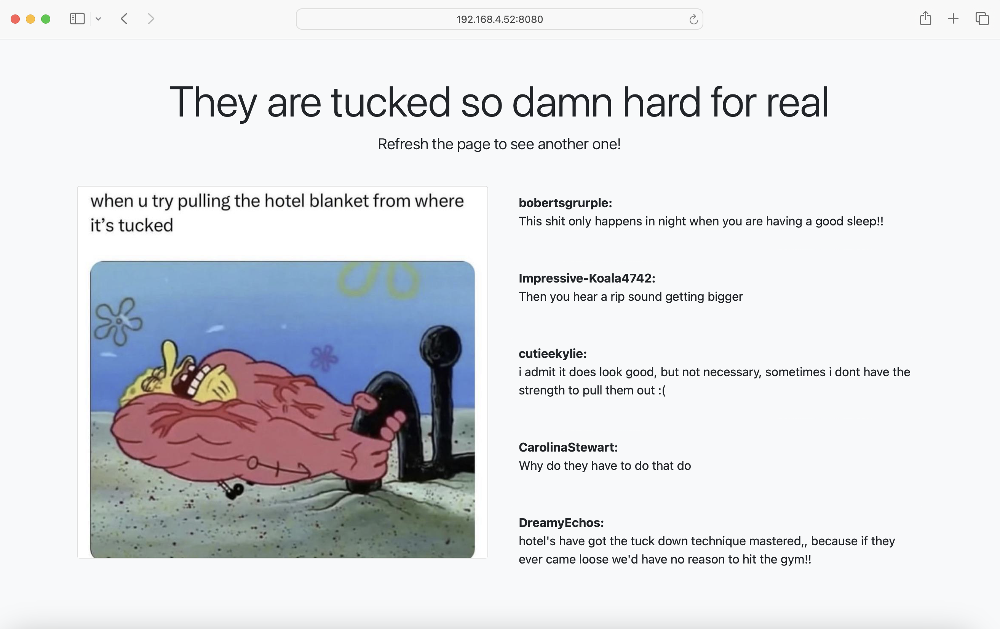

# Random Meme Viewer

## Overview

**Random Meme Viewer** is a simple Flask web application that fetches and displays a random meme from the r/memes subreddit. The app also displays the top 5 comments for the selected meme, providing a fun and engaging way to explore memes.

This project demonstrates how to use Flask, PRAW (Python Reddit API Wrapper), and Bootstrap to build a dynamic web application that interacts with Reddit's API.

## Features

- Displays a random meme from the r/memes subreddit.
- Shows the top 5 comments for the selected meme.
- Responsive design using Bootstrap.
- Simple and clean user interface.

## Prerequisites

Before running the application, ensure you have the following installed on your machine:

- **Python 3.x**
- **pip** (Python package installer)
- **Flask** and **PRAW** libraries
